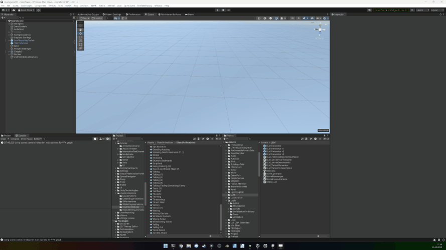

# Unity Compiling Scripts Window Bouncer

This Python script finds Unity compilation windows (containing "Compiling scripts" in their title) and makes them bounce around the screen like the classic DVD screensaver logo. 

When making this I said to myself *"Why fix the long compiling issue when it can bounce instead?"*

## GIF



## Features

- Automatically detects Unity compilation windows
- Makes the windows bounce around the screen like the DVD logo
- Detects collisions with screen edges
- Works with multiple monitors
- Runs indefinitely until manually stopped

## Requirements

- Windows operating system
- Python 3.6+
- pywin32 package

## Installation

1. Clone or download this repository
2. Create a virtual environment:
   ```
   python -m venv venv
   ```
3. Activate the virtual environment:
   ```
   .\venv\Scripts\activate
   ```
4. Install the required packages:
   ```
   pip install -r requirements.txt
   ```

## Usage

1. Make sure you have Unity open with a compilation window
2. Run the script:
   ```
   python main.py
   ```
3. Press Ctrl+C to stop the script